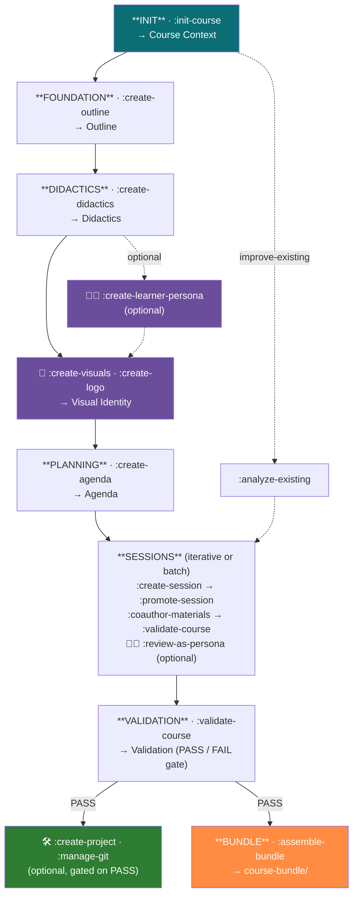

# Teaching-Agent 🎓

> A BMad-Method-powered, multi-agent AI assistant for structured course development with [LiaScript](https://liascript.github.io)

**Teaching-Agent** helps educators design, structure, and author complete courses through guided, iterative workflows — from initial concept to published, interactive materials. It coordinates four specialized agents (teaching, visual design, learner review, and publishing) around a single project file, `journal.md`, that holds the entire course state.

It is **editor-agnostic**: the same specs build into configurations for Claude Code, GitHub Copilot, OpenAI Codex, Cursor, Windsurf, and any web chat.

---

## Table of Contents

- [How It Works](#how-it-works)
- [The Four Agents](#the-four-agents)
- [`journal.md` — the Single Source of Truth](#journalmd--the-single-source-of-truth)
- [The Workflow](#the-workflow)
- [Installation](#installation)
- [Usage](#usage)
- [Commands Reference](#commands-reference)
- [Project Structure](#project-structure)
- [Example Session](#example-session)
- [License](#license)

---

## How It Works

Teaching-Agent follows **Spec-Driven Development**: you define *what* the course should achieve before writing any content.

1. **Define first, write later** — start with learning objectives, audience, and scope
2. **Design didactics deliberately** — choose teaching methods, style, and persona *before* materials
3. **Plan the structure** — build a complete agenda with clear per-session goals
4. **Create iteratively** — develop materials session-by-session, with validation gates at each step

The result is **consistency, traceability, and quality** across the whole course. This implements the **BMad Method** (Behavior-Model-Agnostic Design): defined personas, task-driven workflows, template-based outputs, and built-in validation.

**Learn more:**
- [BMad-Method Framework](https://github.com/bmad-code-org/BMAD-METHOD) — the core methodology
- [`specs/`](./specs/) — the complete technical specification (agents, tasks, templates, workflow)

---

## The Four Agents

The **Teaching-Agent** is the coordinator. It knows when to hand off to the other three via `:agent {name}`. Each agent has its own persona and command set, but they all read and write the same `journal.md`.

| Agent | Icon | Role | Activate with |
|-------|------|------|---------------|
| **Teaching** | 🎓 | Pedagogical structure & content (default) | active on start |
| **Artist** | 🎨 | Visual identity, logos, image prompts | `:agent artist` |
| **Learner** | 🧑‍🎓 | Persona-based, learner-perspective review | `:agent learner` |
| **Development** | 🛠️ | Git, publishing, GitHub Pages | `:agent development` |

The Teaching-Agent proactively suggests a handoff at the right moments — e.g. `:agent artist` after didactics are done, `:agent learner` after a session is validated, or `:agent development` once the course passes validation.

---

## `journal.md` — the Single Source of Truth

All planning, state, reviews, and notes live in **one file**: `journal.md`. It is itself a valid LiaScript document, so the project state is also a viewable course outline. Only final teaching materials (`materials/`), visual assets (`assets/`), and publishing files (`project.yaml`, `.github/workflows/`) stay separate.

`journal.md` is divided into fixed sections, each owned by a task:

| Section | Filled by | Contents |
|---------|-----------|----------|
| `## Dashboard` | `:update-dashboard` (auto) | Derived progress overview |
| `## Course Context` | `:init-course` | Course type, terminology, conventions |
| `## Outline` | `:create-outline` | Title, audience, learning objectives |
| `## Didactics` | `:create-didactics` | Teaching concept, persona, difficulty |
| `## Visual Identity` | `:create-visuals` | Colors, logo & image style |
| `## Templates` | `:manage-templates` | LiaScript template imports & usage |
| `## Agenda` | `:create-agenda` | Session structure |
| `## Sessions` | `:create-session` … | Per-session skeletons, validation & persona reviews |
| `## Agents` | `:configure-agent`, `:create-learner-persona` | Agent customizations, learner personas |
| `## Validation` | `:validate-course` | Latest validation summary (publishing gate) |
| `## Analysis Status` | `:analyze-existing` | Gap analysis for existing courses |
| `## Notes Backup` | `:save-notes`, `:save-decision` | Summaries, research, decision records |

---

## The Workflow



### Course types

`:init-course` first asks for a **course type**, which sets terminology, persona, pacing, and whether an agenda is required:

| Type | Terminology | Persona | Agenda |
|------|-------------|---------|--------|
| `lecture-series` | session / lecture | professor | required |
| `self-paced` | unit / module | coach | optional |
| `workshop` | block / activity | facilitator | required |
| `single-lesson` | lesson | tutor | optional |
| `improve-existing` | (from existing) | (from existing) | runs `:analyze-existing` |

### Two ways to build sessions

- **Iterative** — fully develop one session (create → promote → coauthor → validate → review), then move to the next. Focused.
- **Batch** — create all skeletons, then promote all, then coauthor all. Overview-first.

### Fast-track: `:scaffold`

If you already know what you want, `:scaffold` replaces `:init-course → :create-outline → :create-didactics → :create-agenda → :create-session` with a **single intake interview** followed by automatic generation of the whole structure. Co-authoring stays interactive afterward.

### Publishing gate

Publishing (`:create-project`, `:update-project`) and bundling (`:assemble-bundle`) are **blocked until** `:validate-course` records `Mode: course` + `Result: PASS` in `## Validation`. This keeps half-finished courses from being shipped.

---

## Installation

### 1. Get the project

```bash
git clone <your-repo-url> teaching-agent
cd teaching-agent
```

### 2. Build the agent configuration for your editor

The source of truth lives in `specs/`. The build script renders it into the right format for each environment:

```bash
# Requires Python 3 (+ PyYAML for the navigation targets)
pip install pyyaml

python specs/build.py            # build all targets
python specs/build.py claude     # only Claude Code  → CLAUDE.md
python specs/build.py copilot    # only Copilot      → .github/copilot-instructions.md
python specs/build.py nav        # all "navigation" editors (claude, codex, cursor, windsurf)
python specs/build.py bundle     # all "bundle" targets (copilot, web)
```

| Target | Output file | Environment |
|--------|-------------|-------------|
| `claude` | `CLAUDE.md` | Claude Code CLI |
| `copilot` | `.github/copilot-instructions.md` | GitHub Copilot (VS Code / Web) |
| `codex` | `.codex/AGENTS.md` | OpenAI Codex CLI |
| `cursor` | `.cursor/rules/agent.md` | Cursor IDE |
| `windsurf` | `.windsurfrules` | Windsurf IDE |
| `web` | `dist/web-bundle.md` | Web chat (paste manually) |

There are **two build modes**:

- **Navigation** (`claude`, `codex`, `cursor`, `windsurf`): a lightweight pointer file. The agent reads each task file from `specs/` on demand — keeps context small.
- **Bundle** (`copilot`, `web`): one self-contained Markdown with all specs inlined, for environments without filesystem access. Paste `dist/web-bundle.md` into any chat.

> The generated files are committed, so for the supported editors you can often skip the build and just open the project.

---

## Usage

### Claude Code

Open the project — `CLAUDE.md` is picked up automatically. Then issue commands directly:

```
:help
:init-course
```

### GitHub Copilot (VS Code)

`.github/copilot-instructions.md` is loaded automatically. In Copilot Chat:

```
:help
:scaffold
```

### Cursor / Windsurf / Codex

Open the project; the respective rules file (`.cursor/rules/agent.md`, `.windsurfrules`, `.codex/AGENTS.md`) is read at startup. Issue the same `:` commands.

### Web chat (Claude.ai, ChatGPT, …)

Paste the contents of `dist/web-bundle.md` as the first message, then start with `:help`.

In every environment the agent introduces itself, reads `journal.md` if it exists, and tells you which step comes next.

---

## Commands Reference

### Teaching-Agent 🎓

| Command | Purpose |
|---------|---------|
| `:init-course` | Initialize project; choose course type; create Course Context |
| `:scaffold {course-type?}` | Fast-track: one interview → full structure |
| `:analyze-existing` | Scan an existing course and fill gaps (`improve-existing`) |
| `:create-outline` | Title, audience, 3–5 learning objectives |
| `:create-didactics` | Teaching concept, instructor persona, difficulty |
| `:create-learner-persona {name?}` | Build an evidence-based learner persona |
| `:create-agenda` | Structure sessions / modules |
| `:manage-templates {name?}` | Add & document LiaScript template imports |
| `:update-dashboard` | Regenerate the derived `## Dashboard` |
| `:create-session {n} {type} {title?}` | Create a session skeleton |
| `:promote-session {n} {type}` | Expand skeleton into `materials/{n}-{type}.md` |
| `:coauthor-materials` | Interactive content co-authoring in persona |
| `:quick-fix {n} {type} {description}` | Targeted single-issue correction |
| `:validate-course [{n} {type}]` | Full course check, or single-session check |
| `:assemble-bundle` | Package everything into `course-bundle/` |
| `:save-notes {type?} {title?}` | Save a summary / research / decision note |
| `:save-decision {title}` | Save a structured decision record (ADR) |
| `:configure-agent {agent}` | Customize an agent's behavior in `journal.md` |
| `:agent {character}` · `:list-agents` | Switch persona · list available agents |
| `:help` · `:exit` | Show actions · leave persona |

### Artist-Agent 🎨

| Command | Purpose |
|---------|---------|
| `:create-visuals` | Define colors, logo & image style → Visual Identity |
| `:create-logo` | Generate a detailed logo prompt |
| `:create-image {description}` | Create an image prompt on demand |

### Learner-Agent 🧑‍🎓

| Command | Purpose |
|---------|---------|
| `:review-as-persona {name} {n} {type}` | Review a material as a specific learner persona |
| `:list-learners` | List defined learner personas |

### Development-Agent 🛠️

| Command | Purpose |
|---------|---------|
| `:manage-git` | Stage, commit, push, diff, resolve conflicts |
| `:create-project` | Generate `project.yaml` + GitHub Pages workflow |
| `:update-project` | Update publishing config & redeploy |

---

## Project Structure

```
specs/
  main.md              ← web-bundle header
  build.py             ← config generator (run this to (re)build)
  project.yaml         ← example LiaScript publishing config
  agents/              ← agent personas (teaching, artist, learner, development)
  tasks/               ← one task definition per command
  templates/           ← YAML templates for journal.md sections
  checklists/          ← quality checks (used by :validate-course)
  data/                ← LiaScript cheat-sheet & workflow reference
  workflows/           ← course-development.yaml (the master workflow)

journal.md             ← project state (single source of truth)
materials/             ← generated LiaScript course materials
assets/                ← generated visual assets & prompts

CLAUDE.md              ← generated: Claude Code config
.github/copilot-instructions.md  ← generated: Copilot config
.codex/AGENTS.md       ← generated: Codex config
.cursor/rules/agent.md ← generated: Cursor config
.windsurfrules         ← generated: Windsurf config
dist/web-bundle.md     ← generated: paste-anywhere bundle
```

---

## Example Session

```
:init-course
   → Choose "lecture-series", title "Databases Unlocked",
     audience "CS undergraduates (3rd–5th semester)", language de, Sie-form

:create-outline
   → 5 learning objectives, abstract on database paradigms

:create-didactics
   → Persona: "practical professor, hands-on, browser-based examples"

:agent artist → :create-visuals
   → Teal/orange palette, consistent course image style

:agent teaching → :create-agenda
   → Blocks: file formats → key-value → document → relational SQL

:create-session 1 lecture "Data & Serialization"
:promote-session 1 lecture
:coauthor-materials
   → Add interactive DuckDB-Wasm examples and a quiz

:validate-course 1 lecture
:agent learner → :review-as-persona alex 1 lecture
   → Check cognitive load and assumed prior knowledge

:agent teaching → :validate-course        # full course → PASS
:agent development → :create-project       # publish to GitHub Pages
:assemble-bundle                           # distributable package
```

---

## License

[Boost Software License 1.0](./LICENSE) — a permissive license allowing free use, modification, and distribution.

---

**Ready to build your course?** Start with:

```
:help
```
